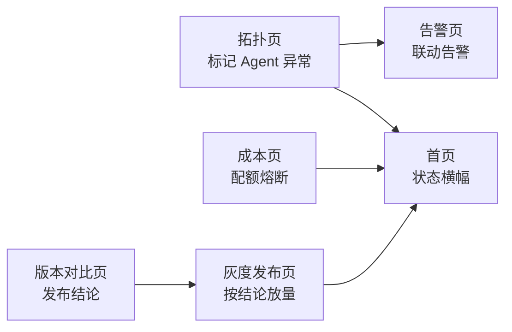
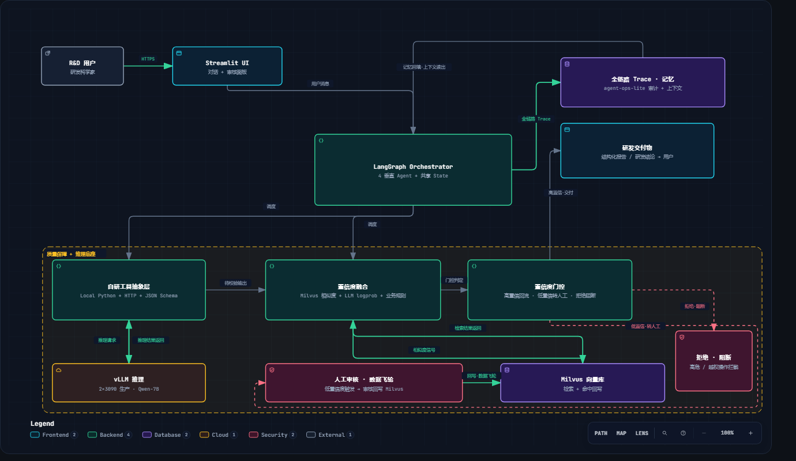
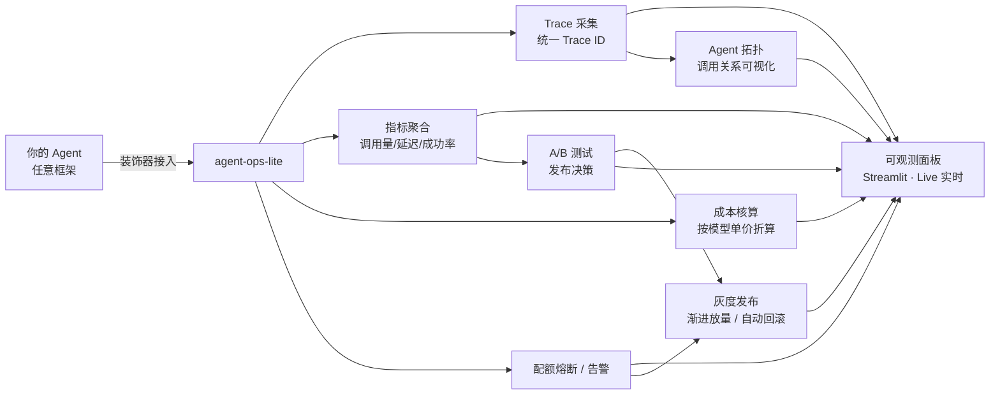

# agent-ops-lite

**Agent 可观测与成本管控轻量工具** —— 采集 Agent 调用日志，聚合为可读指标，支撑从 Demo 到生产的运维闭环。


[]()


> 🚀 **在线 Demo**：常驻实例 <http://82.156.184.242:8501>；云端备份 [agent-ops-lite.streamlit.app](https://agent-ops-lite.streamlit.app/)（闲置会自动休眠）。

---

## 为什么做这个

LLM Agent 从 Demo 走向生产，一定会撞上这些问题：

- 一次 Agent 调用内部有多次模型请求和工具调用，**出错了很难定位是哪一步**
- Token 成本按 Agent / 按模型 / 按工具**算不清楚**
- 成本超支没有**配额熔断**机制，只能事后补救
- 缺少统一 Trace ID，日志散落各处，**排查全靠猜**

agent-ops-lite 用最轻的方式解决这些问题：**接入一个装饰器，就能拿到全链路日志、指标与成本**。

## 功能特性

- **全链路 Trace**：一次调用内的每个步骤（意图 / 规划 / 检索 / 工具 / 生成）自动串联，失败步骤高亮，重试可见
- **多维指标**：调用量、延迟、Token、成功率，按 Agent / 按工具 / 按天聚合
- **成本核算**：按模型单价自动折算成本，支持多模型计价
- **配额熔断**：每日成本配额（`AGENTOPS_DAILY_QUOTA_CNY`，默认 50¥），LLM 调用前真实拦截，超限抛 `QuotaExceeded` 拒绝
- **告警规则**：错误率阈值触发告警，慢调用 Top N 自动列出；**Webhook 告警**（企业微信 / 飞书机器人）超阈值自动推送
- **持久化存储**：内置 SQLite 存储后端（零依赖），重启不丢、历史可查；存储接口可替换为 Elasticsearch / ClickHouse
- **跨页联动**：拓扑异常 / 配额熔断 / 发布结论 / 灰度进度全局共享——任一页面操作，全系统同步感知（模拟真实生产"所有面板读同一后端"）
- **Agent Skill**：内置 `agentops-observe` skill——SKILL.md（触发词 + 三步接入 + 参数规范）+ 配套闭环演示脚本，让任意 Agent 直接学会用本库
- **MCP Server**：内置 `agent_ops.mcp_server`——零依赖手写实现 MCP stdio 协议（JSON-RPC 2.0），暴露 5 个工具（report / model_usage / traces / history / check_alerts），Claude Desktop / Cursor 可直接连接查询观测数据
- **零依赖核心**：纯 Python 标准库实现，不绑定 LangChain / 任何具体框架（MCP 协议层也只用标准库，不依赖任何 MCP SDK）

## Agent Skill：agentops-observe

仓库内置一个可直接使用的 Agent Skill，用于**教任意 Agent 给自身加可观测性**：

```
skills/agentops-observe/
├─ SKILL.md                        # 触发词 + 三步接入 + 核心 API 速查 + 典型用法
└─ scripts/observe_agent.py        # 四步闭环演示：采集 → 聚合 → 告警 → 持久化
```

```bash
python skills/agentops-observe/scripts/observe_agent.py
```

一键跑通完整闭环：`@trace` 采集（含父子 span + 失败标记）→ `report()` 聚合 → 告警阈值命中（本地 mock HTTP 验证 POST 格式）→ SQLite 落库 + 模拟重启恢复。

**Skill 与核心库的分工**：SKILL.md 负责"教 Agent 怎么用"（触发条件 / 步骤 / 参数），`agent_ops` 负责"真正干活"（零依赖实现）。触发词准确、指令可执行、失败可降级——Agent 按需加载，不撑爆上下文。

## MCP Server：agent-ops-lite as MCP

仓库还内置一个 **MCP（Model Context Protocol）Server**——把 agent-ops-lite 的能力暴露给 AI 客户端，Claude Desktop / Cursor / 任意 MCP client 可以直接连接、查询观测数据。**与 Skill 形成双线**：Skill 教 Agent 给自己加观测，MCP 让外部 AI 直接读观测数据。

**核心卖点**：MCP 协议层也是**零依赖纯标准库手写**——JSON-RPC 2.0 over stdio，不依赖任何第三方 MCP SDK。"懂协议、不靠框架"。

### 暴露的工具

| 工具             | 作用                                           |
| -------------- | -------------------------------------------- |
| `report`       | 生成聚合报告（总调用 / 成功率 / 错误率 / 成本 / 按 Agent 按模型分组） |
| `model_usage`  | 按模型归因用量统计（成本降序，含父子 span 归因）                  |
| `traces`       | 列出最近 Trace（展平成行，与面板表格字段一致）                   |
| `history`      | 查询 SQLite 持久化的历史 Trace（含嵌套步骤树）               |
| `check_alerts` | 检查告警规则是否触发（错误率 / 成本超阈值，只检查不发送）               |

### 本地试跑（stdio 模式）

```bash
# 启动 MCP server（--demo 启动时填充演示数据，方便连接即可见）
python -m agent_ops.mcp_server --demo

# 或自定义 SQLite 路径
python -m agent_ops.mcp_server --demo --db /path/to/agent_ops.db
```

### 接入 Claude Desktop

在 `~/Library/Application Support/Claude/claude_desktop_config.json`（macOS）或对应配置文件添加：

```json
{
  "mcpServers": {
    "agent-ops-lite": {
      "command": "python",
      "args": ["-m", "agent_ops.mcp_server", "--demo"],
      "cwd": "/path/to/agent-ops-lite"
    }
  }
}
```

重启 Claude Desktop，对话里就能直接说"查一下 agent-ops 的报告 / 最近有哪些失败的 trace / 错误率超过 10% 吗"——Claude 自动调用对应工具。

## 快速开始

```bash
cd app
pip install -r requirements.txt
streamlit run Home.py
```

浏览器打开 `http://localhost:8501`，即可查看完整面板。

> Demo 默认使用 2000 条模拟数据（固定随机种子，可复现），**数据结构与真实采集完全一致**——接入真实数据源即可用于生产。默认空库运行于 🟡 模拟模式；前往「真实 Agent」或「数据管理」页一键播种真实数据即切 🟢 真实模式（Trace 自动落库 SQLite，详见下方「生产级加固」）。

### 核心库：3 行接入任意 Agent

`agent_ops` 是零依赖的核心采集库，用装饰器包裹任意 Agent 函数，自动完成 **采集 → 聚合 → 成本核算**：

```python
from agent_ops import trace, record_step, report

@trace(agent="检索 Agent")                      # ① 装饰器一挂
def my_agent(question: str) -> str:
    record_step("知识检索", model="qwen-plus",   # ② 记录每一步
                tool="知识库检索", tokens_in=800, tokens_out=120)
    return "答案"

my_agent("什么是 AgentOps?")                    # ③ 正常调用，自动采集
print(report())                                 # → 成功率 / 延迟 / token / 成本
```

- 函数抛异常 → Trace 自动标记 `failed` 并记录失败原因
- 采集的 `Step` / `Trace` 字段与观测面板**完全一致**（测试验证过），面板可直接消费
- 完整示例见 [`examples/quickstart.py`](examples/quickstart.py)

```bash
# 运行示例（含失败场景与聚合报告）
python examples/quickstart.py
```

### 核心库 × LangGraph：真实框架接入

`agent_ops` 不绑定任何框架——用 LangGraph 的 `StateGraph` 搭一个 3 节点 Agent（检索 → 生成 → 校验），`@trace` 装饰器包住图的调用入口即可自动采集：

```python
from langgraph.graph import END, StateGraph
from agent_ops import trace, record_step, report

@trace(agent="研发问答 Agent")          # ① 包住 LangGraph 图调用入口
def run_agent(question: str) -> str:
    result = graph.invoke({"question": question})   # ② 正常跑你的图
    return result["answer"]

# ③ 节点函数 = 天然 step 边界，内部 record_step 记录
def retrieve_node(state):
    record_step("知识库检索", model="qwen-plus",
                tool="知识库检索", tokens_in=400, tokens_out=120)
    ...
```

- 节点抛异常 → 整条 Trace 自动标记 `failed` 并记录失败原因（可定位到具体节点）
- 完整可运行示例见 [`examples/langgraph_example.py`](examples/langgraph_example.py)

```bash
# 运行 LangGraph 示例（需先安装：pip install langgraph）
python examples/langgraph_example.py
```

### 父子 span：一个工具内部还能再分层

`span()` 是上下文管理器，创建"父步骤"，块内所有 `record_step` 自动挂为它的子步骤——适合把一次工具调用的内部拆成多段（如检索链路里的向量检索 + 精排）：

```python
from agent_ops import span

with span("RAG 检索链路", model="qwen-plus"):   # 父步骤
    record_step("向量检索", tool="Milvus", tokens_in=300, tokens_out=100)
    record_step("精排",     tool="Rerank", tokens_in=100, tokens_out=20)
```

- 成本 / 延迟 / token 自动**递归聚合**到父步骤，`report()` 总账含子步骤
- `report()["by_model"]` / `model_usage()` 把 token 与成本**归因到真实模型**（父子 span 不重复计费）
- 容器自身不自动计时（避免与子步骤双计），需要时可显式传 `latency_ms`

### 持久化存储：重启不丢、历史可查

`Collector` 可挂存储后端（内置 `SQLiteStore`，零依赖；实现 `TraceStore` 协议即可换 Elasticsearch / ClickHouse）：

```python
from agent_ops import Collector, SQLiteStore, trace, report

store = SQLiteStore("agent_ops.db")
collector = Collector(storage=store)

@trace(collector=collector)
def my_agent(question: str): ...

# 重启后：新 Collector 挂同一存储，自动从库中恢复历史
fresh = Collector(storage=SQLiteStore("agent_ops.db"))
print(report(fresh))   # 历史 Trace 直接可聚合
```

### 告警 Webhook：超阈值自动推送

`WebhookAlert` 消费 `report()` 指标，错误率 / 成本超阈值时向企业微信或飞书机器人推送：

```python
from agent_ops import WebhookAlert, AlertRule, report

alert = WebhookAlert(
    webhook_url="https://qyapi.weixin.qq.com/cgi-bin/webhook/send?key=xxx",
    rules=[AlertRule("error_rate", ">", 0.10, "错误率超 10%"),
           AlertRule("total_cost_usd", ">", 1.0, "成本超 $1")],
)
fired = alert.check_and_send(report())   # 一次调用：检查 + 发送
```

### 联动演示（30 秒讲完的完整闭环）



1. 「Agent 拓扑」页选中"推理 Agent"→ 异常写入全局状态
2. 切到「告警与异常」→ 该 Agent 联动告警亮起；回首页 → 顶部横幅变红
3. 「版本对比」出 A/B 结论 → 一键带入「灰度发布」→ 暂缓发布时放量按钮被禁用
4. 「成本核算」配额拖低 → 触发熔断 → 首页横幅提示"成本配额熔断"

> 设计理念：真实生产中所有面板读同一个后端（Prometheus / ES / Redis），  
> 本 Demo 用 `shared_state.py` 模拟这个共享后端，实现全系统状态互通。

## 语料（可切换的域）

RAG 语料按「域」组织，用环境变量 `RAG_CORPUS` 切换（见 `app/rag_retriever.py` 顶部）：

| `RAG_CORPUS` | 文件 | 内容 | 与线上关系 |
| --- | --- | --- | --- |
| `ivd`（默认） | `rag_data/docs_ivd_section.jsonl` | **体外诊断试剂域**：NMPA 器审中心注册审查指导原则 172 篇，section-aware 切片 → 9004 chunks（chunk 前缀带「文档标题 · 一级章节 · 二级章节」） | 线上现行 |
| `ivd_naive` | `rag_data/docs_ivd_naive.jsonl` | 同一批文档的**朴素标点切分**（350 字、无章节前缀）→ 6352 chunks | 消融基线 |
| `general` | `rag_data/docs_general.jsonl` | 通用医疗对照域（华佗百科抽样）→ 5000 chunks | 跨域对照 |

- **来源可回溯**：语料许可 CC BY 4.0，逐篇带 `doc_number` / `source_url` / `effective_date`，清单见 `rag_data/ivd_manifest.json`（可点回器审中心原始发布页）。
- **接入即真实**：`RAG_CORPUS` 只决定加载哪份语料，检索与门控逻辑不变。

## 检索效果评测（可复现）

检索层有没有效果，不该靠感觉。仓库内置一套可复现评测：固定种子生成评测集 → 多配置消融 / 多语料对照 → 输出 Hit@k / Recall@k / MRR。

```bash
# 1) 生成评测集（种子固定，任何机器结果一致）
python scripts/build_eval_set.py --corpus ivd --level doc             # 文档级 172 条（gold 中位 54 块）
python scripts/build_eval_set.py --corpus ivd --level section --n 800 # 章节级 800 条（gold 中位 1 块）

# 2) 跑评测（--verify-online 读线上语料与 TITLE_WEIGHT，复现同一索引逐条比对 top1，口径不漂移）
python scripts/eval_rag.py --corpus ivd --verify-online --markdown eval_report_ivd.md
python scripts/eval_rag.py --corpus ivd --eval-set rag_data/eval_set_ivd_sec.jsonl --sweep 0,1,3,5
python scripts/eval_rag.py --corpus ivd_naive --label 朴素切分基线      # 跨切片策略对照
```

**评测集的两个维度**：

| 维度 | 取值 | query 来源 | 衡量什么 | 需要 API |
| --- | --- | --- | --- | --- |
| 难度 | easy（默认） | 语料原始标题 / 章节名 | 消融对比（同一评测集横向比配置） | 否，零成本 |
| 难度 | hard（`--llm`） | DeepSeek 改写的口语化提问（刻意避开原文用词） | **真实泛化** | 是 |
| 粒度 | `doc`（默认） | 文档标题；gold = 该文档全部 chunk | 能否**找到正确文档** | 否 |
| 粒度 | `section` | 标题 + 章节名；gold = 该章节 chunk | 能否**定位到正确章节** | 否 |

> ⚠️ easy 档 query 与原文同源，绝对分数偏高，**不能当作真实泛化能力对外宣称**——真实泛化请跑 hard 档。
> ⚠️ **粒度决定能不能看到差异**：文档级在 IVD 语料上有**天花板效应**（content-only 的 Hit@5 也已是 1.000，因为文档标题是高区分度长专名），只能证明"能找到文档"；切片策略的差异必须到**章节级**才暴露。文档级 gold 集很大（中位 54 块），**Recall@k 不可解读**（上限≈k/|gold|），只读 Hit@k / MRR。

### 消融 A · 章节级（IVD 域 · 800 条 · gold 中位 1 块）

| 配置 | Hit@1 | Hit@3 | Hit@5 | Hit@10 | Recall@5 | MRR@10 |
| --- | --- | --- | --- | --- | --- | --- |
| content-only（历史对照） | 0.509 | 0.661 | 0.731 | 0.831 | 0.701 | 0.606 |
| title×1 + content | 0.625 | 0.757 | 0.812 | 0.871 | 0.777 | 0.703 |
| **title×3 + content（线上现行）** | **0.720** | **0.839** | **0.880** | **0.926** | **0.849** | **0.791** |
| title×5 + content | 0.786 | 0.900 | 0.943 | 0.964 | 0.915 | 0.852 |

> ×5 在本表上更好（Hit@1 0.786 vs 0.720），但 easy 档正例取自文档标题、与真实口语提问存在风格差异，**暂不据此调参**——保持 ×3，待 hard 档验证后再决定。

### 消融 B · 文档级跨切片策略（同一批文档 · 同一份 query）

| 语料 | 切分策略 | chunks | Hit@1（content-only） | Hit@3 | Hit@5 |
| --- | --- | --- | --- | --- | --- |
| `ivd` | section-aware（章节边界 + 上下文前缀） | 9004 | 0.959 | 0.988 | 1.000 |
| `ivd_naive` | 朴素标点切分（350 字、无前缀） | 6352 | 0.930 | 1.000 | 1.000 |

> 结论保持克制：**文档级两者都接近满分**，这一级不适合评估切片策略。section-aware 的价值在「检索到的那一块是否就是答案所在章节」，即消融 A 的指标。

### 消融 C · 历史（通用域 · 200 条 · 5000 chunks）

| 配置 | Hit@1 | Hit@3 | Hit@5 | Hit@10 | Recall@5 | MRR@10 |
| --- | --- | --- | --- | --- | --- | --- |
| content-only（原始实现） | 0.310 | 0.405 | 0.485 | 0.535 | 0.477 | 0.380 |
| **title×3 + content（线上现行）** | **0.980** | **1.000** | **1.000** | **1.000** | **1.000** | **0.990** |
| title×5 + content | 0.990 | 1.000 | 1.000 | 1.000 | 1.000 | 0.995 |

**发现**：原始实现建索引时只对正文分词、**丢弃了标题信号**，Hit@5 仅 0.485；把标题以 ×3 权重并入索引后达到 1.000。**该改造已合入线上**（`TITLE_WEIGHT=3`，可用 `RAG_TITLE_WEIGHT=0` 退回对照）。

评测脚本支持任意权重扫描（`--sweep`）、失败样例诊断（`--show-fails N`）、运行标签（`--label`，多语料对照时写进表格首列）与 markdown 导出（`--markdown`）。

### 置信度门控校准：**信号最优解随语料翻转，不可迁移**

检索分最终要喂给置信度门控，判断「库内可答 / 库外不可答」——这是幻觉抑制链条的第一道闸门。

```bash
python scripts/eval_gate.py --corpus ivd --show-leaks --markdown gate_report.md
```

**关键前提**：线上 `retrieve(top_k=4)` 只返回 4 个分数，归一化只能用这 4 个的**内部**统计量。用全库 mean/std 算的 z-score 看着更强，但**线上复现不了**，只是离线幻觉。

实测（easy 档，FPR ≤ 10% 最优选点）——**同一套信号，换语料后排名完全反转**：

| 语料 | gold 集大小 | `ratio = top1/mean(top4)` | `top1` 绝对分 |
| --- | --- | --- | --- |
| 通用域（华佗，QA 块） | 1 块 | **AUC 0.983**（库内保留 95.5%） | AUC 0.923（保留 76.0%） |
| IVD · section-aware | ≈54 块 | **AUC 0.168**（库内保留 **0.0%**） | AUC 1.000（保留 100%） |
| IVD · 朴素切分 | ≈36 块 | AUC 0.423（库内保留 **0.0%**） | AUC 1.000（保留 100%） |

**根因**：`ratio` 衡量的是「top1 是否显著高于第 2~4 名」。**当一个答案由多块共同承载（gold 集大），top4 会全部命中同一文档、分数彼此接近 → `ratio` 恒等于 1.0，信号自毁。** 任何写死在某个语料上标定的门控常数都会失效——这是本项目第二次踩到同一类坑（第一次是 `sigmoid(top_bm25 / 3.0)` 的计算量级错配；第三次、也是最有价值的一次见下节）。

**easy 档上的规则对照**（阈值取各单信号 FPR≤10% 选点；**注意这一栏有风格偏差，见下节**）：

| 规则 | 库内保留 | 库外拦截 | 结论 |
| --- | --- | --- | --- |
| `abs` 单独 | 100.0% | 90.5% | 看着最好——但是假象（见下节） |
| `ratio` 单独 | **0.0%** | 90.5% | IVD 语料下不可用（库内被全误拦） |
| AND：abs 低 且 ratio 低 | 100.0% | 81.0% | 对单信号失效有韧性 |
| OR：abs 低 或 ratio 低 | 0.0% | 100.0% | 不可接受 |

### ⚠️ 决定性一测：人工口语问题把「完美 AUC」拆穿了

easy 档正例取自**文档标题逐字**，所以 `abs` 才显得完美可分（正例 min 30.32 vs 负例 max 29.28）。但那是**查询风格**的产物，不是判别能力。`eval_gate.py --natural` 内置了 20 条**人工撰写的口语化库内问题**（零成本 hard 档代理，每条 top1 命中的都是**对题的文档**，说明检索本身没问题）：

| 观测（IVD 语料 · title×3） | 数值 |
| --- | --- |
| 噪声底（随机 4 词探针 top1） | p50 = 21.5 / p90 = 25.0 |
| easy 档正例 top1 | min 30.32（标题逐字） |
| **人工口语档内问题 top1** | **15.4 ~ 37.6** |
| 库外问题 top1 | 0 ~ 29.3 |
| **两组区间** | **完全重叠 → 不可分** |

**用 easy 档选出的阈值（25.4）上线，实测误拦 13/20 = 65% 的真实库内提问。** 这就是本项目最值得记的一条教训：*不是 AUC 高就可用，还要看间隔是否落在噪声区、以及正例的构造方式是否与真实用法同分布。*

**灵敏度**（`eval_gate.py --natural` 可直接复现）：

| `ABS_GATE` | 库内保留（人工口语） | 库外拦截 |
| --- | --- | --- |
| 25.4（easy 档选点） | 35%（**误拦 13/20**） | 76% |
| 20.0 | 90% | 48% |
| 15.0 | 100% | 29% |
| **12.0（当前默认）** | **100%（误拦 0/20）** | 10% |
| 0.0（关闭） | 100% | 0% |

### 现规则：**降级为「极端无支撑熔断」，而不是判别器**

结论是：**BM25 分数在这套语料上不具备「库内 / 库外判别」能力**。所以检索层门控不再假装是判别器，只做一件可靠的事——拦住检索几乎零支撑的极端情形：

```python
# app/butler_fusion.py（阈值可用 RAG_ABS_GATE / RAG_RATIO_GATE 覆盖）
if ratio < RATIO_GATE and top1 < ABS_GATE:      # 1.14 且 12.0
    confidence = min(confidence, 0.20)
```

- 两个信号**同时**报警才拦（AND），实测库内误拦 **0%**；
- 库外拦截只覆盖 **10%**，其余交给后续两层（LLM 自评 + 输出层对齐 + hedge 词规则）——它们才是库外拦截的主力；
- **不对外宣称「库外拦截率 X%」**；要提高拦截率必须先用 hard 档（`build_eval_set.py --llm`）重新标定阈值。

## 页面导览

> 共 **12 个功能页面 + 总览首页**（总览 Dashboard 为 `Home.py`，其余为 `app/pages/` 下 1~12 编号页面）。默认空库为 🟡 模拟模式，前往「真实 Agent」/「数据管理」一键播种真实数据即切 🟢 真实模式。

| 页面               | 功能                                                | 解决的问题                 |
| ---------------- | ------------------------------------------------- | --------------------- |
| **总览 Dashboard** | 调用量 / Token / 成本 / 延迟 + 趋势图，支持 **Live 每秒实时刷新**    | 一屏看全系统健康度             |
| **链路追踪**         | Trace ID 搜索，步骤级展开明细                               | 异常定位从小时级缩短到分钟级        |
| **工具分析**         | 工具调用量 / 成功率 / 平均耗时                                | 一眼找出拖垮整体的工具           |
| **成本核算**         | 按 Agent / 按天拆解成本 + 配额熔断                           | 成本不再是一笔糊涂账            |
| **告警与异常**        | 慢调用 Top10 + 错误率阈值线                                | 生产化告警闭环               |
| **版本对比**         | A/B 测试：成功率 / 延迟 / 成本对比 + 发布结论                     | 用数据决定是否全量发布           |
| **灰度发布**         | 10% → 50% → 100% 渐进放量 + 异常自动回滚                    | 发布不是一把梭，分阶段可控         |
| **Agent 拓扑**     | Agent 间调用关系网络图，可模拟任一 Agent 异常并联动明细                | 看清谁在调用谁，异常 Agent 一眼定位 |
| **真实 Agent 调用**  | 真实 DeepSeek + IVD 域 RAG（NMPA 指导原则）调用，Trace 自动落库（真实优先，空库回退模拟） | 验证真实 LLM 链路可观测        |
| **数据管理**         | 一键播种真实数据 / 清空，切换 🟢真实·🟡模拟模式                 | 真实数据驱动闭环              |
| **操作日志**         | 访问 / 运行 / 播种 / 清空全程时间戳留痕（审计时间线）                   | 操作可审计、可追溯             |
| **人工审核回写**       | 低置信度转人工 → 审核回写 → 复问采信（置信度飞轮）                      | 闭环可信增强                |
| **系统架构图**         | archify 编译的端到端架构全景（编排→工具→置信度门控→vLLM/检索/记忆双向→低置信转人工/拒绝阻断→研发交付物→全链路 Trace），可切 Classic / SIGNAL FLOW | 一图讲清整体架构与质量闸门（与「Agent 拓扑」互补：拓扑证真、架构讲全） |

## 系统架构全景（archify 可视化）

下图是「项目五 研发管家」的端到端架构，与「Agent 拓扑」页互补：**拓扑证真（代码实时画、异常可联动），架构讲全（一图看清质量闸门与全链路）**。

Orchestrator 集中式编排 → 自研工具抽象层 → 置信度门控（高置信交付 / 低置信转人工 / 拒绝阻断）→ vLLM / Milvus / 记忆的**请求-响应双向**链路 → 人工审核回写 Milvus（数据飞轮）→ 全链路 Trace → 研发交付物。



> 交互版见在线 Demo 的「系统架构图」页 <http://82.156.184.242:8501>，可现场切 Classic / SIGNAL FLOW 预设；PNG / SVG / HTML 产物同目录 `app/assets/`（PNG 用于 GitHub README 稳定显示，SVG 矢量源与 HTML 交互版可下载）。

## 架构



## 技术栈

| 层    | 选型                               | 理由                                 |
| ---- | -------------------------------- | ---------------------------------- |
| 面板   | Streamlit + Plotly               | 纯 Python，几十行出一个页面，交互图表原生支持         |
| 数据处理 | pandas                           | 聚合计算，生态成熟                          |
| 核心库  | 纯标准库 + dataclass + typing        | 零依赖、可嵌入任何框架                        |
| 部署   | Streamlit Cloud / 腾讯云 Lighthouse | 免费托管或常驻实例，`requirements.txt` 提交即部署 |


## 目录结构

```
agent-ops-lite/
├─ app/                    # Live Demo（独立可跑）
│  ├─ Home.py              # 总览 Dashboard（含系统状态横幅 + 实时时钟）
│  ├─ shared_state.py      # 全局共享状态（跨页联动核心，模拟共享后端）
│  ├─ demo_data.py         # 模拟数据生成器（2000 条 Trace，可复现）
│  ├─ requirements.txt
│  └─ pages/
│     ├─ 1_链路追踪.py
│     ├─ 2_工具分析.py
│     ├─ 3_成本核算.py
│     ├─ 4_告警与异常.py
│     ├─ 5_版本对比.py
│     ├─ 6_灰度发布.py
│     ├─ 7_Agent拓扑.py
│     ├─ 8_真实Agent.py
│     ├─ 9_数据管理.py
│     ├─ 10_操作日志.py
│     ├─ 11_人工审核回写.py
│     └─ 12_系统架构图.py    # archify 架构图嵌入页（HTML/PNG/SVG 资产在 app/assets/）
│  ├─ assets/                 # 静态资产（archify 生成的架构图：.png / .svg / .html / .json 同目录；PNG 用于 README，HTML/SVG 用于交互页）
├─ examples/               # 接入示例（3 行接入 + LangGraph + MCP client）
│  ├─ quickstart.py        # 3 行接入普通函数（含失败场景）
│  ├─ langgraph_example.py # LangGraph 3 节点线性图接入（检索→生成→校验）
│  ├─ multi_agent_example.py # LangGraph 多 Agent 协作（Orchestrator + 4 垂直 Agent + 条件路由）
│  ├─ mcp_client_demo.py   # 最小 MCP client（纯标准库，连 mcp_server 跑通握手+全工具）
│  └─ requirements.txt      # examples 依赖（langgraph），核心库不受影响
├─ skills/                 # Agent Skill：让 Agent 学会用本库（SKILL.md + 脚本）
│  └─ agentops-observe/    # 给任意 Agent 加可观测性（触发词 / 三步接入 / 闭环演示）
│     ├─ SKILL.md
│     └─ scripts/observe_agent.py  # 四步闭环演示（采集→聚合→告警→持久化）
├─ agent_ops/              # 核心库：采集 / 聚合 / 成本 / 存储 / 告警（零依赖）
│  ├─ __init__.py          # 公共 API：trace / record_step / report
│  ├─ tracer.py            # @trace 装饰器 + Collector 采集器（支持挂存储）
│  ├─ metrics.py           # 指标聚合（与面板 KPI 口径一致）
│  ├─ cost.py              # 成本核算（模型单价与面板一致）
│  ├─ storage.py           # 持久化存储：SQLiteStore / MemoryStore（协议可换 ES）
│  ├─ alerts.py            # 告警：WebhookAlert（企业微信 / 飞书，阈值规则）
│  └─ mcp_server.py        # MCP Server：零依赖手写 stdio 协议，5 个工具供 AI 客户端连接
├─ scripts/                # 语料构建 / 评测 / 部署与运维脚本
│  ├─ build_ivd_corpus.py  # IVD 语料构建（naive | section 双策略切片器）
│  ├─ build_rag.py         # 通用对照域语料（华佗百科 → docs_general.jsonl）
│  ├─ build_eval_set.py    # 评测集生成（doc / section 两种粒度，种子固定可复现）
│  ├─ eval_rag.py          # 检索评测（Hit@k / Recall@k / MRR，多配置·多语料对照）
│  ├─ eval_gate.py         # 门控校准（AUC + 噪声底 + 间隔 + 阈值选点 + 规则对照）
│  └─ verify_butler.py     # 研发管家多步编排本地校验（mock LLM，无需 Key）
├─ rag_data/               # RAG 语料与评测集
│  ├─ docs_ivd_section.jsonl  # 线上默认语料：IVD 域 section-aware 切片（9004 chunks）
│  ├─ docs_ivd_naive.jsonl    # 同批文档的朴素切分基线（6352 chunks，不进部署包）
│  ├─ docs_general.jsonl      # 通用医疗对照域（华佗百科，5000 chunks）
│  ├─ ivd_manifest.json       # 逐篇元数据（标题 / 文号 / 来源 URL / chunk 数）
│  ├─ eval_set_ivd.jsonl      # 文档级评测集（172 条）
│  ├─ eval_set_ivd_sec.jsonl  # 章节级评测集（800 条，gold 中位 1 块）
│  └─ reviewed.jsonl          # 人工审核回写的知识（运行时产物）
├─ tests/                  # 核心库测试（85 项断言，含 MCP 协议 + 数据兼容性 + 韧性层回归）
│  ├─ test_core.py         # 零依赖核心库回归
│  └─ test_agent_runner.py # 真实 Agent 韧性层回归（需 app 依赖，由 CI 单独执行）
└─ README.md
```

## 生产级加固（Phase 0 / 1）

本 Demo 的机制层（多 Agent 编排 / 置信度融合 / 人工回写飞轮 / 全链路观测）已是真实实现；  
以下把"工程化封装"补齐，使其逼近企业级落地：

### Phase 0 · 去模拟（真实数据驱动）

面板默认读 `agent_ops.db`（`demo_data.load_traces()` 真实优先、空库才回退模拟）。  
先一次性播种少量真实数据让全站切到 🟢 真实数据模式（脚本默认 40 RAG + 8 研发管家
+ 15 通用 + 3 真实失败，研发管家还是多步调用，请勿直接放进高频 cron）：

```bash
# 一次性播种（研发管家较慢，推荐后台执行）
cd /path/to/agent-ops-lite && python scripts/seed_real_data.py --rag 5 --butler 2 --general 3 --failures 1 >> seed.log 2>&1
```

### Phase 1 · 韧性层 / 配额拦截 / 健康检查

- **调用层韧性**：所有 LLM 调用 funnel 到统一 `_chat_completion` 入口
  （`_deepseek_chat` / `chat_with_logprobs` 都走它），统一加
  超时（`AGENTOPS_REQ_TIMEOUT_S`，默认 30s）、指数退避重试（限流/超时/5xx）、  
  主模型耗尽后切 `DEEPSEEK_FALLBACK_MODEL`。
- **真实配额拦截**：每次调用前 `check_quota()` 查 `agent_ops.db` 真实日成本，  
  超 `AGENTOPS_DAILY_QUOTA_CNY`（默认 50¥）即抛 `QuotaExceeded` 拒绝——  
  从「滑杆写 shared_state 的 UI 模拟」升级为「调用前真实拦截」。
- **健康检查**：`python scripts/healthz.py --port 8080`，`/healthz` 返回  
  DB 可达性 / Trace 新鲜度 / API Key 配置，供 K8s 探针或监控拨测。
- **真实告警**：`python scripts/alert_check.py` 读 `report()` 聚合指标，  
  错误率 / 成本超阈值时向 `AGENTOPS_WEBHOOK_URL` 真实推送（与 seed 同节奏挂 cron）。

### 环境变量

复制模板后填写：`cp .env.example .env`。脚本类工具（`scripts/*.py`）会自行读取项目根 `.env`，
**无需手动 `export`**；Streamlit 进程需重启才重新加载。`.env` 及其变体（`.env.local` 等）均已被忽略。

| 变量                         | 默认                            | 说明                       |
| -------------------------- | ----------------------------- | ------------------------ |
| `DEEPSEEK_API_KEY`         | —                             | DeepSeek OpenAI 兼容密钥（必填） |
| `DEEPSEEK_BASE_URL`        | `https://api.deepseek.com/v1` | 兼容端点                     |
| `DEEPSEEK_MODEL`           | `deepseek-chat`               | 主模型                      |
| `DEEPSEEK_FALLBACK_MODEL`  | 空（不降级）                        | 主模型重试耗尽后的兜底模型            |
| `AGENTOPS_REQ_TIMEOUT_S`   | `30`                          | 单次 LLM 调用超时（秒）           |
| `AGENTOPS_MAX_RETRIES`     | `3`                           | 指数退避重试次数                 |
| `AGENTOPS_BACKOFF_S`       | `1.0`                         | 退避基数（秒）                  |
| `AGENTOPS_DAILY_QUOTA_CNY` | `50`                          | 每日成本配额（¥），`<=0` 关闭拦截     |
| `AGENTOPS_WEBHOOK_URL`     | 空（仅打印）                        | 告警机器人地址（企业微信 / 飞书）       |
| `AGENTOPS_WEBHOOK_TYPE`    | `wecom`                       | `wecom` / `feishu`       |
| `RAG_CORPUS`               | `ivd`                         | 语料域：`ivd` / `ivd_naive` / `general`（或 `*.jsonl` 路径） |
| `RAG_TITLE_WEIGHT`         | `3`                           | 标题在 BM25 索引中的重复次数，`0` = 退回纯正文索引 |
| `RAG_ABS_GATE`             | `12.0`                        | 检索层硬门控：top1 绝对分下限（极端无支撑熔断；换语料需重标定） |
| `RAG_RATIO_GATE`           | `1.14`                        | 检索层硬门控：`top1/mean(top_k)` 下限（换语料需重标定） |

## Roadmap

- [x] Live Demo：13 页面完整面板（总览 + 12 功能页，真实优先 · 缺数据自动回退可复现模拟）
- [x] `agent_ops` 核心库：装饰器采集真实 Trace（85 项测试通过，数据与面板打通）
- [x] 多框架适配：LangGraph 真实示例（3 节点图，失败自动标记）
- [x] 父子 span：工具内部嵌套分层 + 按模型归因（`model_usage` / `by_model`）
- [x] 存储后端：SQLite 持久化（零依赖，接口可换 Elasticsearch）
- [x] 告警通知：企业微信 / 飞书 Webhook（阈值规则自动推送）
- [x] 单元测试与 CI（GitHub Actions：核心库 85 项 + 真实 Agent 韧性层，双 Python 版本矩阵）
- [x] Agent Skill：`agentops-observe`（SKILL.md + 触发词 + 闭环演示脚本）
- [x] MCP Server：`agent_ops.mcp_server`（零依赖手写 stdio 协议，Claude Desktop / Cursor 可直连）
- [x] 生产级加固 Phase 0：真实数据播种（cron 持续落库，全站 mode=real）
- [x] 生产级加固 Phase 1：调用层韧性（超时/重试/fallback）+ 真实配额拦截 + 健康检查 + 告警 cron
- [x] 检索效果评测：可复现评测集（种子固定）+ 索引配置消融（Hit@5 0.485 → 1.000，改造已合入线上）
- [x] IVD 域语料：NMPA 器审中心指导原则 172 篇（CC BY 4.0，逐篇可回溯）+ section-aware 切片 + 朴素切分基线，`RAG_CORPUS` 可切换
- [x] 章节级检索评测（800 条，gold 中位 1 块）：定位到了文档级看不见的差异（Hit@1 0.509 → 0.720）
- [x] 门控校准基建：噪声底检查 + 正负例间隔 + 复合规则对照（暴露「高 AUC 低余量」）；检索层硬门控改为保守 AND 规则
- [ ] 门控阈值 hard 档重标定（口语化正例，需 `DEEPSEEK_API_KEY`）——当前阈值由 easy 档标定，间隔仅 1.05 分，迁移性未验证
- [ ] 多框架适配：Dify / 自研 Agent
- [ ] 服务化（FastAPI + 独立 worker + Redis）与权限感知 RAG / 审计留痕（Phase 2/3）

## License

[MIT](LICENSE)
