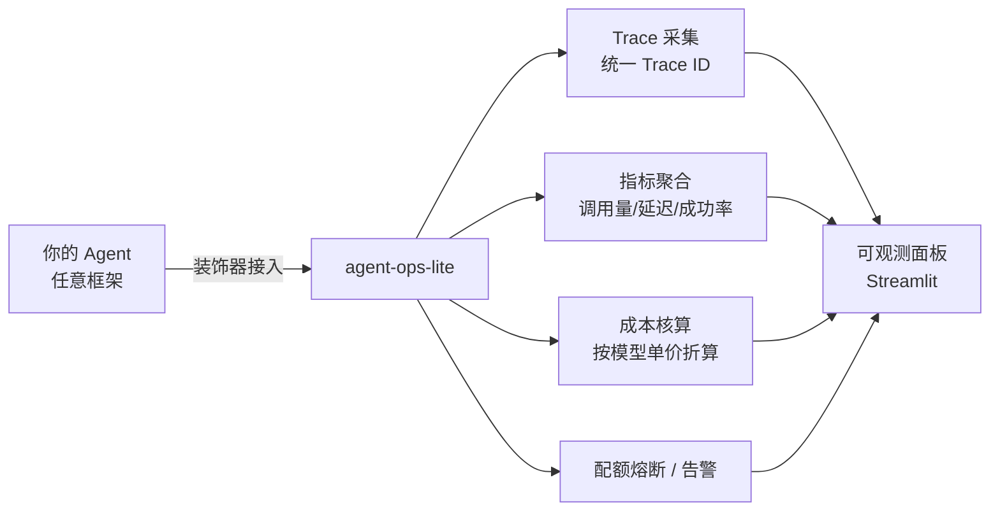

# agent-ops-lite

**Agent 可观测与成本管控轻量工具** —— 采集 Agent 调用日志，聚合为可读指标，支撑从 Demo 到生产的运维闭环。

[](LICENSE)
[]()

> 🚀 **在线 Demo**：[agent-ops-lite.streamlit.app](https://agent-ops-lite-cvxtlfredwnfmjhx8qwfmq.streamlit.app/)

---

## 为什么做这个

LLM Agent 从 Demo 走向生产，一定会撞上这些问题：

- 一次 Agent 调用内部有多次模型请求和工具调用，**出错了很难定位是哪一步**
- Token 成本按 Agent / 按模型 / 按工具**算不清楚**
- 成本超支没有**配额熔断**机制，只能事后补救
- 缺少统一 Trace ID，日志散落各处，**排查全靠猜**

agent-ops-lite 用最轻的方式解决这些问题：**接入一个装饰器，就能拿到全链路日志、指标与成本**。

## 功能特性

- **全链路 Trace**：一次调用内的每个步骤（意图 / 规划 / 检索 / 工具 / 生成）自动串联，失败步骤高亮，重试可见
- **多维指标**：调用量、延迟、Token、成功率，按 Agent / 按工具 / 按天聚合
- **成本核算**：按模型单价自动折算成本，支持多模型计价
- **配额熔断**：每日成本配额，超限自动拒绝低优先级调用（Demo 中可交互体验）
- **告警规则**：错误率阈值触发告警，慢调用 Top N 自动列出
- **零依赖核心**：纯 Python 标准库实现，不绑定 LangChain / 任何具体框架

## 快速开始

```bash
cd app
pip install -r requirements.txt
streamlit run Home.py
```

浏览器打开 `http://localhost:8501`，即可查看完整面板。

> Demo 使用 2000 条模拟数据（固定随机种子，可复现），**数据结构与真实采集完全一致**——接入真实数据源即可用于生产。

## 页面导览

| 页面 | 功能 | 解决的问题 |
| --- | --- | --- |
| **总览 Dashboard** | 调用量 / Token / 成本 / 延迟 + 趋势图 | 一屏看全系统健康度 |
| **链路追踪** | Trace ID 搜索，步骤级展开明细 | 异常定位从小时级缩短到分钟级 |
| **工具分析** | 工具调用量 / 成功率 / 平均耗时 | 一眼找出拖垮整体的工具 |
| **成本核算** | 按 Agent / 按天拆解成本 + 配额熔断 | 成本不再是一笔糊涂账 |
| **告警与异常** | 慢调用 Top10 + 错误率阈值线 | 生产化告警闭环 |
| **版本对比** | A/B 测试：成功率 / 延迟 / 成本对比 + 发布结论 | 用数据决定是否全量发布 |
| **灰度发布** | 10% → 50% → 100% 渐进放量 + 异常自动回滚 | 发布不是一把梭，分阶段可控 |

## 架构



## 技术栈

| 层 | 选型 | 理由 |
| --- | --- | --- |
| 面板 | Streamlit + Plotly | 纯 Python，几十行出一个页面，交互图表原生支持 |
| 数据处理 | pandas | 聚合计算，生态成熟 |
| 核心库 | 纯标准库 + dataclass + typing | 零依赖、可嵌入任何框架 |
| 部署 | Streamlit Cloud | 免费托管，`requirements.txt` 提交即部署 |

## 目录结构

```
agent-ops-lite/
├─ app/                    # Live Demo（独立可跑）
│  ├─ Home.py              # 总览 Dashboard
│  ├─ demo_data.py         # 模拟数据生成器（2000 条 Trace，可复现）
│  ├─ requirements.txt
│  └─ pages/
│     ├─ 1_链路追踪.py
│     ├─ 2_工具分析.py
│     ├─ 3_成本核算.py
│     ├─ 4_告警与异常.py
│     ├─ 5_版本对比.py
│     └─ 6_灰度发布.py
├─ examples/               # 一行代码接入示例（规划中）
├─ agent_ops/              # 核心库：采集 / 聚合 / 成本 / 熔断（开发中）
└─ README.md
```

## Roadmap

- [x] Live Demo：7 页面完整面板（模拟数据）
- [ ] `agent_ops` 核心库：装饰器采集真实 Trace
- [ ] 存储后端：SQLite / Elasticsearch 可选
- [ ] 多框架适配：LangGraph / Dify / 自研 Agent
- [ ] 告警通知：企业微信 / 飞书 Webhook
- [ ] 单元测试与 CI

## License

[MIT](LICENSE)
