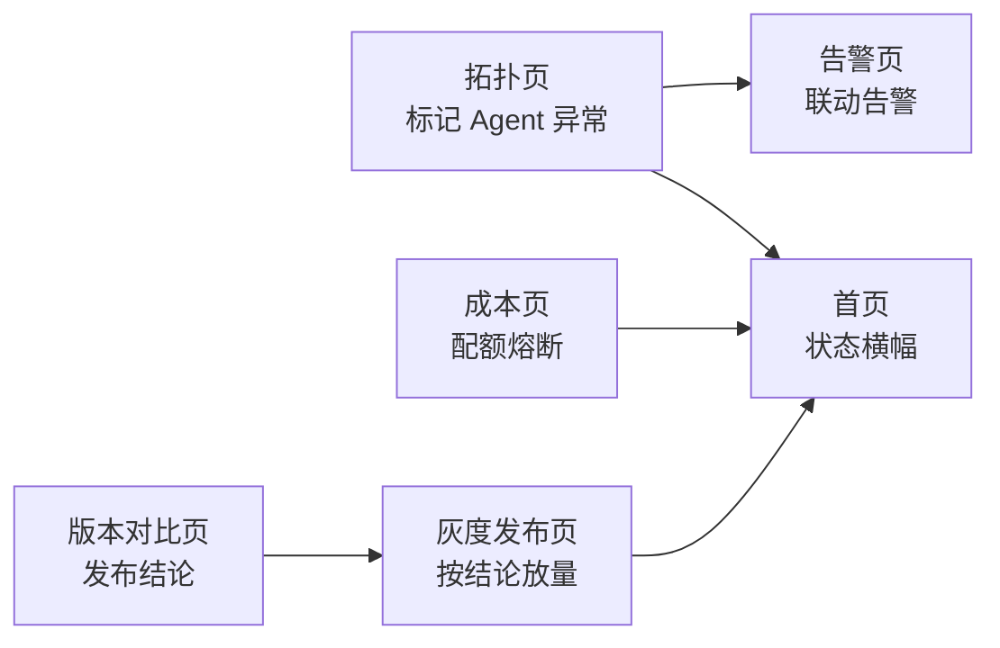
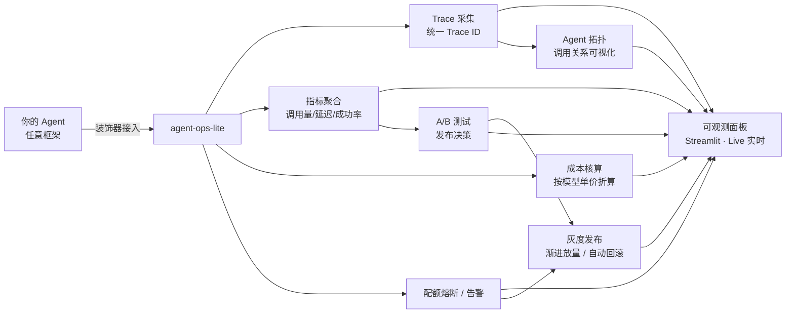

# agent-ops-lite

**Agent 可观测与成本管控轻量工具** —— 采集 Agent 调用日志，聚合为可读指标，支撑从 Demo 到生产的运维闭环。

[](LICENSE)
[]()

> 🚀 **在线 Demo**：[agent-ops-lite.streamlit.app](https://agent-ops-lite.streamlit.app/)

---

## 为什么做这个

LLM Agent 从 Demo 走向生产，一定会撞上这些问题：

- 一次 Agent 调用内部有多次模型请求和工具调用，**出错了很难定位是哪一步**
- Token 成本按 Agent / 按模型 / 按工具**算不清楚**
- 成本超支没有**配额熔断**机制，只能事后补救
- 缺少统一 Trace ID，日志散落各处，**排查全靠猜**

agent-ops-lite 用最轻的方式解决这些问题：**接入一个装饰器，就能拿到全链路日志、指标与成本**。

## 功能特性

- **全链路 Trace**：一次调用内的每个步骤（意图 / 规划 / 检索 / 工具 / 生成）自动串联，失败步骤高亮，重试可见
- **多维指标**：调用量、延迟、Token、成功率，按 Agent / 按工具 / 按天聚合
- **成本核算**：按模型单价自动折算成本，支持多模型计价
- **配额熔断**：每日成本配额，超限自动拒绝低优先级调用（Demo 中可交互体验）
- **告警规则**：错误率阈值触发告警，慢调用 Top N 自动列出
- **跨页联动**：拓扑异常 / 配额熔断 / 发布结论 / 灰度进度全局共享——任一页面操作，全系统同步感知（模拟真实生产"所有面板读同一后端"）
- **零依赖核心**：纯 Python 标准库实现，不绑定 LangChain / 任何具体框架

## 快速开始

```bash
cd app
pip install -r requirements.txt
streamlit run Home.py
```

浏览器打开 `http://localhost:8501`，即可查看完整面板。

> Demo 使用 2000 条模拟数据（固定随机种子，可复现），**数据结构与真实采集完全一致**——接入真实数据源即可用于生产。

### 核心库：3 行接入任意 Agent

`agent_ops` 是零依赖的核心采集库，用装饰器包裹任意 Agent 函数，自动完成 **采集 → 聚合 → 成本核算**：

```python
from agent_ops import trace, record_step, report

@trace(agent="检索 Agent")                      # ① 装饰器一挂
def my_agent(question: str) -> str:
    record_step("知识检索", model="qwen-plus",   # ② 记录每一步
                tool="知识库检索", tokens_in=800, tokens_out=120)
    return "答案"

my_agent("什么是 AgentOps?")                    # ③ 正常调用，自动采集
print(report())                                 # → 成功率 / 延迟 / token / 成本
```

- 函数抛异常 → Trace 自动标记 `failed` 并记录失败原因
- 采集的 `Step` / `Trace` 字段与观测面板**完全一致**（测试验证过），面板可直接消费
- 完整示例见 [`examples/quickstart.py`](examples/quickstart.py)

```bash
# 运行示例（含失败场景与聚合报告）
python examples/quickstart.py
```

### 联动演示（30 秒讲完的完整闭环）



1. 「Agent 拓扑」页选中"推理 Agent"→ 异常写入全局状态
2. 切到「告警与异常」→ 该 Agent 联动告警亮起；回首页 → 顶部横幅变红
3. 「版本对比」出 A/B 结论 → 一键带入「灰度发布」→ 暂缓发布时放量按钮被禁用
4. 「成本核算」配额拖低 → 触发熔断 → 首页横幅提示"成本配额熔断"

> 设计理念：真实生产中所有面板读同一个后端（Prometheus / ES / Redis），
> 本 Demo 用 `shared_state.py` 模拟这个共享后端，实现全系统状态互通。

## 页面导览

| 页面 | 功能 | 解决的问题 |
| --- | --- | --- |
| **总览 Dashboard** | 调用量 / Token / 成本 / 延迟 + 趋势图，支持 **Live 每秒实时刷新** | 一屏看全系统健康度 |
| **链路追踪** | Trace ID 搜索，步骤级展开明细 | 异常定位从小时级缩短到分钟级 |
| **工具分析** | 工具调用量 / 成功率 / 平均耗时 | 一眼找出拖垮整体的工具 |
| **成本核算** | 按 Agent / 按天拆解成本 + 配额熔断 | 成本不再是一笔糊涂账 |
| **告警与异常** | 慢调用 Top10 + 错误率阈值线 | 生产化告警闭环 |
| **版本对比** | A/B 测试：成功率 / 延迟 / 成本对比 + 发布结论 | 用数据决定是否全量发布 |
| **灰度发布** | 10% → 50% → 100% 渐进放量 + 异常自动回滚 | 发布不是一把梭，分阶段可控 |
| **Agent 拓扑** | Agent 间调用关系网络图，可模拟任一 Agent 异常并联动明细 | 看清谁在调用谁，异常 Agent 一眼定位 |

## 架构



## 技术栈

| 层 | 选型 | 理由 |
| --- | --- | --- |
| 面板 | Streamlit + Plotly | 纯 Python，几十行出一个页面，交互图表原生支持 |
| 数据处理 | pandas | 聚合计算，生态成熟 |
| 核心库 | 纯标准库 + dataclass + typing | 零依赖、可嵌入任何框架 |
| 部署 | Streamlit Cloud | 免费托管，`requirements.txt` 提交即部署 |

## 目录结构

```
agent-ops-lite/
├─ app/                    # Live Demo（独立可跑）
│  ├─ Home.py              # 总览 Dashboard（含系统状态横幅）
│  ├─ shared_state.py      # 全局共享状态（跨页联动核心，模拟共享后端）
│  ├─ demo_data.py         # 模拟数据生成器（2000 条 Trace，可复现）
│  ├─ requirements.txt
│  └─ pages/
│     ├─ 1_链路追踪.py
│     ├─ 2_工具分析.py
│     ├─ 3_成本核算.py
│     ├─ 4_告警与异常.py
│     ├─ 5_版本对比.py
│     ├─ 6_灰度发布.py
│     └─ 7_Agent拓扑.py
├─ examples/               # 接入示例（3 行接入，含失败场景）
│  └─ quickstart.py
├─ agent_ops/              # 核心库：采集 / 聚合 / 成本核算（零依赖）
│  ├─ __init__.py          # 公共 API：trace / record_step / report
│  ├─ tracer.py            # @trace 装饰器 + Collector 采集器
│  ├─ metrics.py           # 指标聚合（与面板 KPI 口径一致）
│  └─ cost.py              # 成本核算（模型单价与面板一致）
├─ tests/                  # 核心库测试（18 项断言，含数据兼容性）
│  └─ test_core.py
└─ README.md
```

## Roadmap

- [x] Live Demo：8 页面完整面板（模拟数据 · Live 实时模式）
- [x] `agent_ops` 核心库：装饰器采集真实 Trace（18 项测试通过，数据与面板打通）
- [ ] 存储后端：SQLite / Elasticsearch 可选
- [ ] 多框架适配：LangGraph / Dify / 自研 Agent
- [ ] 告警通知：企业微信 / 飞书 Webhook
- [ ] 单元测试与 CI

## License

[MIT](LICENSE)
